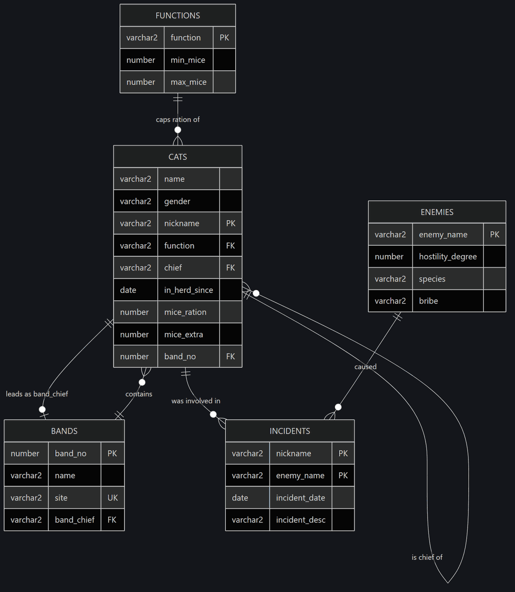

# Oracle Database Laboratories

Database Systems coursework from Wrocław University of Science and Technology,
built around one small domain: a herd of cats organised into hunting bands, each
cat holding a function that caps its ration, each logging its run-ins with the
herd's enemies.

Five relations are enough to reach most of what Oracle offers — a
self-referencing hierarchy, a circular foreign key, cursors, packages, compound
triggers, and the object-relational layer on top of all of it.



## Layout

```
sql/01_schema/              tables, constraints, and the seed data
sql/02_queries/             filtering, hierarchies, joins, sets, Top-N
sql/03_plsql/               blocks, cursors, procedures, packages, triggers
sql/04_object_relational/   object types, typed tables, REF navigation
assignments/                the assignment sheets, as issued
docs/                       the schema reference
```

## Running it

Against any Oracle instance — XE is enough. In order:

```sql
@sql/01_schema/01_drop_all.sql
@sql/01_schema/02_create_tables.sql
@sql/01_schema/03_seed_data.sql

@sql/02_queries/01_filtering_and_functions.sql
@sql/02_queries/02_hierarchical_queries.sql
@sql/02_queries/03_joins_and_sets.sql
@sql/02_queries/04_subqueries_and_top_n.sql

@sql/03_plsql/01_blocks_and_exceptions.sql
@sql/03_plsql/02_cursors.sql
@sql/03_plsql/03_procedures_and_packages.sql
@sql/03_plsql/04_triggers.sql
```

The object-relational lab takes foreign keys against the relational schema, so
run `sql/01_schema` first:

```sql
@sql/04_object_relational/00_drop_all.sql
@sql/04_object_relational/01_types_and_tables.sql
@sql/04_object_relational/02_seed_data.sql
@sql/04_object_relational/03_ref_navigation.sql
```

Each script is idempotent: the teardown scripts swallow "does not exist", and
every block that modifies data ends in `ROLLBACK`.

## The schema

Documented with a diagram and a table reference in
**[docs/schema.md](docs/schema.md)**. Two properties shape everything built on
top of it:

**`CATS.chief` points back into `CATS`.** One self-referencing column carries
the whole chain of command. `TIGER` is the root, the tree is four levels deep,
and every `CONNECT BY` query in the repository walks it.

**`CATS` and `BANDS` reference each other.** A cat belongs to a band; a band is
led by a cat. Neither table can be created with both keys in place, and neither
can be seeded without the other holding rows. `CATS` is created without its band
key, the constraint is added by `ALTER TABLE` once `BANDS` exists, bands are
seeded with a null chief, the cats are loaded, and the chiefs are filled in by
`UPDATE`. The alternative — deferrable constraints checked at `COMMIT` — buys
free insert ordering at the cost of per-statement error reporting.

## What is in each part

**Queries.** Predicates and date handling, string and date functions, `CASE`,
grouping and `HAVING`. Then the hierarchy: `CONNECT BY` in both directions,
`SYS_CONNECT_BY_PATH`, `CONNECT_BY_ROOT`, and the same chain-of-chiefs question
answered three ways — repeated outer joins, `CONNECT BY` with `PIVOT`, and a
path string — because the three differ in how they handle depth. Joins and
anti-joins, three formulations of "bands nobody belongs to", and three
formulations of Top-N ending in the row-limiting clause.

**PL/SQL.** `SELECT INTO` and the exceptions it raises rather than returns.
Explicit cursors with `FOR UPDATE` and `WHERE CURRENT OF`, and a fetch loop that
closes its cursor on every path out. A cross-tabulation built by aggregating once
into an associative array rather than querying per cell. A package pairing a
levy calculation with an insert that reports failure through
`RAISE_APPLICATION_ERROR`. And the triggers: row-level, statement-level, and the
same rule implemented twice — once with package state across three triggers, once
as a single compound trigger — to show why the compound version is the one to
reach for.

**Object-relational.** The same domain remodelled with object types. Foreign
keys carrying values become `REF` pointers, joins become dot navigation, and
`SCOPE FOR` pins each pointer to one table so Oracle can resolve it without a
lookup. Member functions put the `NVL` arithmetic on the type instead of at every
call site.

## Technology

**Oracle SQL** and **PL/SQL**, against Oracle 12c or later. Queries cover joins
and anti-joins, set operators (`UNION ALL`, `MINUS`, `NOT EXISTS`),
**hierarchical queries** (`CONNECT BY`, `SYS_CONNECT_BY_PATH`,
`CONNECT_BY_ROOT`, `LEVEL`), **`PIVOT`**, `CASE`, and the **row-limiting
clause** (`FETCH FIRST ... WITH TIES`). PL/SQL covers anonymous blocks,
user-defined exceptions, explicit cursors, **associative arrays**, stored
procedures and **packages**, and triggers of every kind — row-level,
statement-level, **compound**, and `PRAGMA AUTONOMOUS_TRANSACTION` for audit
logging that survives a rollback. The object-relational lab uses **object
types** with member functions and procedures, **typed tables**, **`REF`**
columns constrained by `SCOPE FOR`, and `DEREF` navigation. Diagrams are
**Mermaid**.

## Skills demonstrated

Schema design, including recognising a circular foreign key and choosing between
the two ways out of it · hierarchical querying over a self-referencing table ·
SQL semantics rather than syntax — join grain, `BETWEEN` on dates, `ROWNUM`
against `ORDER BY`, and aggregates that answer a subtly different question than
the one asked · PL/SQL beyond the happy path: exception handling, cursor
lifetime, the mutating-table restriction and why a sequence sidesteps it, and
name resolution between parameters and columns · trigger design, including when
statement-level state re-enters itself and what a compound trigger fixes ·
Oracle's object-relational model and where it pays.

## License

**MIT** — see [`LICENSE`](LICENSE). Free to use, copy, and adapt.
