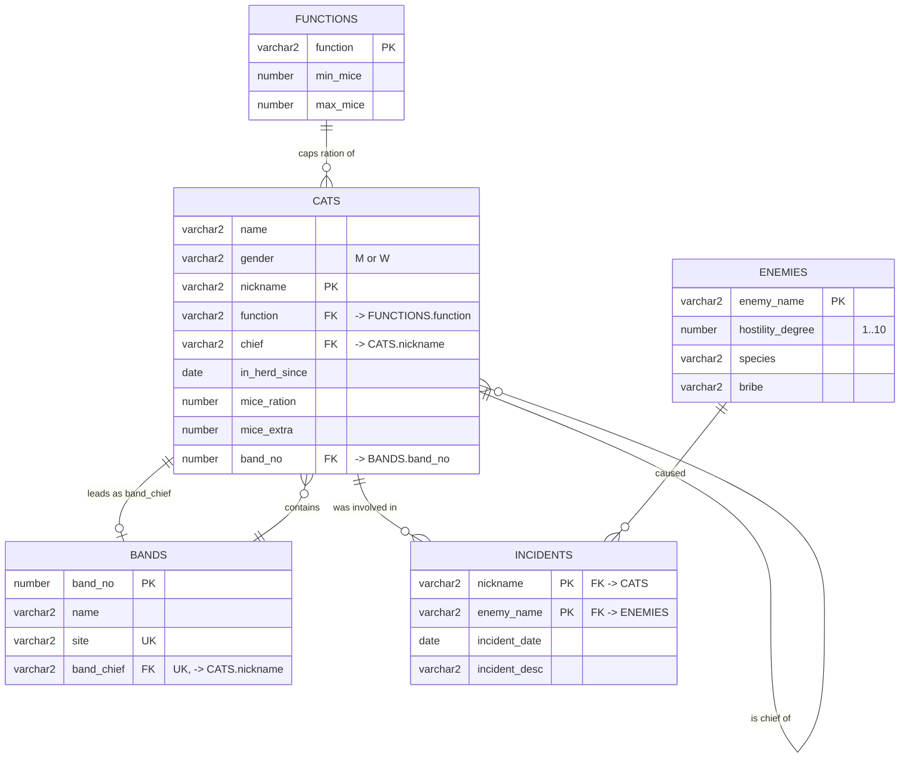

# Schema reference

The exercises all run against one small domain: a herd of cats, organised into
hunting bands, each cat holding a function that caps how many mice it may draw,
and each cat logging its run-ins with the herd's enemies.

## Entity relationship diagram



## The circular dependency

`CATS.band_no` references `BANDS`, and `BANDS.band_chief` references `CATS`.
Neither table can be created with both keys in place, and neither can be seeded
without the other already holding rows.

Both scripts work around it in the same way, and the order is not negotiable:

1. `CATS` is created without its band key.
2. `BANDS` is created in full.
3. `ALTER TABLE CATS ADD CONSTRAINT cats_band_no_fk ...` closes the loop.
4. Seeding inserts `BANDS` rows with `band_chief` NULL, then all of `CATS`,
   then `UPDATE`s the chiefs into place.

The alternative — deferrable constraints checked at `COMMIT` — would let the
inserts run in any order, at the cost of losing per-statement error reporting.

## Self-references

Two columns point back into `CATS`:

| Column | Points at | Meaning |
|---|---|---|
| `CATS.chief` | `CATS.nickname` | The cat this cat reports to. NULL only for `TIGER`, the root. |
| `BANDS.band_chief` | `CATS.nickname` | The cat that leads this band. Unique — no cat leads two bands. |

`CATS.chief` is what every hierarchical query in
[`02_hierarchical_queries.sql`](../sql/02_queries/02_hierarchical_queries.sql)
walks. The hierarchy is four levels deep at its deepest:

```
TIGER (BOSS)
├── BALD (THUG)
│   ├── CAKE, TUBE, FAST, MISS
├── ZOMBIES (THUG)
│   ├── HEN (CATCHING)
│   │   └── ZERO (CAT)
│   └── FLUFFY
├── REEF (CATCHING)
│   └── EAR, SMALL, MAN, LADY
├── LOLA, LITTLE, BOLEK
```

## Reference data

`FUNCTIONS` doubles as a validation table: the trigger in
[`04_triggers.sql`](../sql/03_plsql/04_triggers.sql) rejects any ration outside
the `[min_mice, max_mice]` band of the cat's function.

| Function | Min | Max |
|---|---|---|
| BOSS | 90 | 110 |
| THUG | 70 | 90 |
| CATCHING | 60 | 70 |
| CATCHER | 50 | 60 |
| DIVISIVE | 45 | 55 |
| CAT | 40 | 50 |
| NICE | 20 | 30 |
| HONORARY | 6 | 25 |

Every seeded cat sits inside its function's band, so the trigger fires only on
the deliberate violations at the end of the trigger script.

## The object-relational model

[`sql/04_object_relational`](../sql/04_object_relational) remodels the same
domain using Oracle's object types. Value-carrying foreign keys become `REF`
pointers, and joins become dot navigation:

```sql
-- relational
SELECT c.name FROM Cats c JOIN Cats chief ON c.chief = chief.nickname;

-- object-relational
SELECT c.chief.name FROM CatsR c;
```

Two tables are added that have no relational counterpart:

- `COMMONS` — a cat available to serve an elite.
- `ELITES` — a cat of rank, optionally holding a `REF` to its servant.
- `ACCOUNTS` — a mouse account belonging to an elite, open until `deletion_date`
  is set.

Every `REF` column is declared `SCOPE FOR (col) IS table`, pinning it to one
target table. That makes the pointer smaller, lets Oracle resolve dot navigation
without a lookup, and stops a `REF` pointing at an unexpected table of the same
type.
